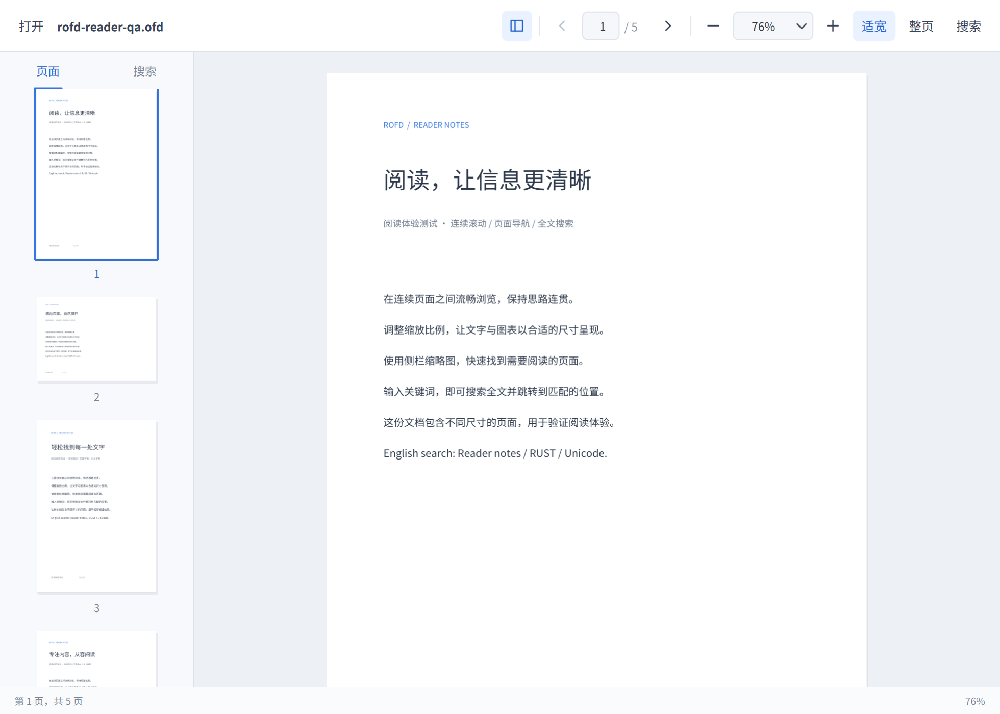
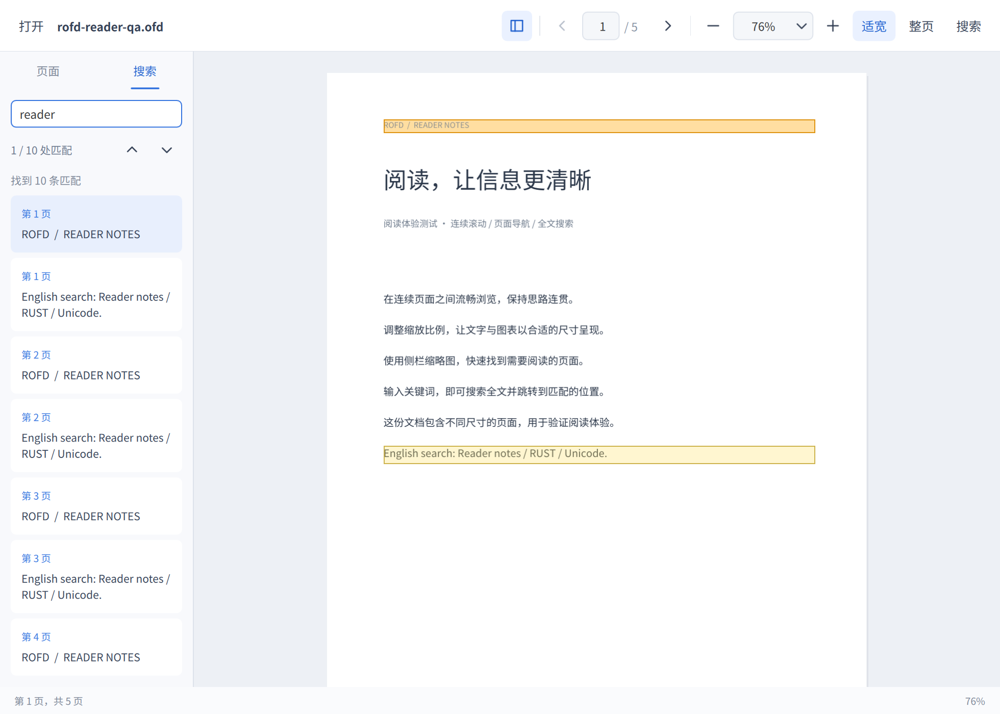
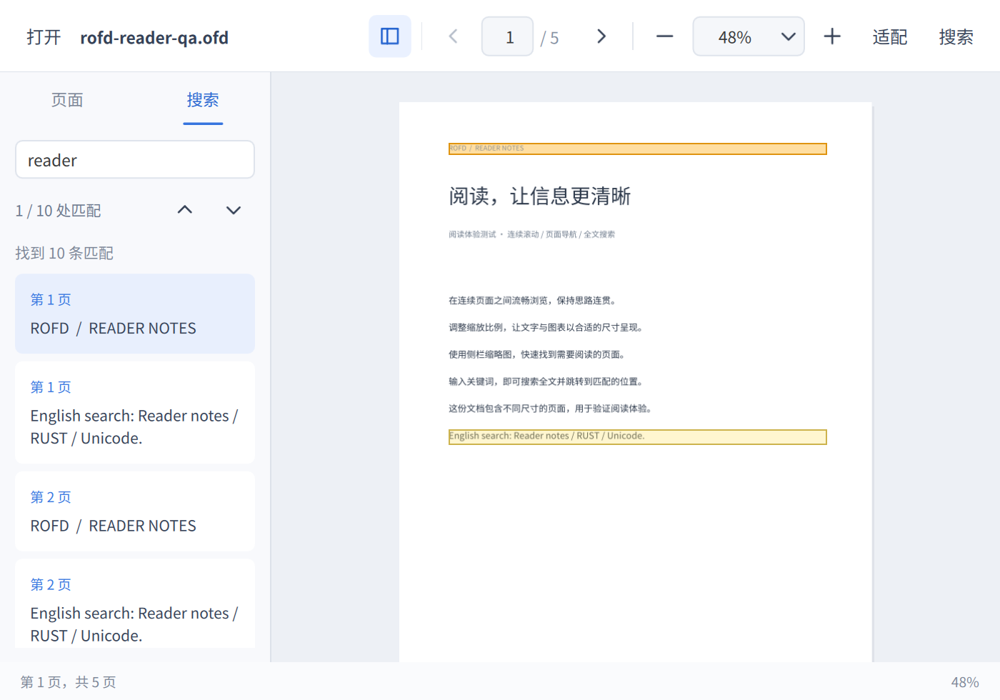

# rofd Qt 阅读器

运行：

```sh
cargo run -p rofd --features qt-reader --bin rofd [file.ofd]
```

支持连续滚动、页码跳转、缩略图导航、25%–400% 缩放、自定义百分比、适合宽度、整页显示，以及中英文全文搜索。可收起侧栏，页面按需渲染，搜索结果包含页码、摘要和页面内的文字区域高亮。

| 操作 | 快捷键 |
| --- | --- |
| 打开文档 | Ctrl+O |
| 搜索 | Ctrl+F |
| 下一处 / 上一处搜索结果 | 搜索框内 Enter / Shift+Enter |
| 关闭搜索 | Esc |
| 放大 / 缩小 | Ctrl++ / Ctrl+-，或 Ctrl+滚轮 |
| 首 / 尾页 | Ctrl+Home / Ctrl+End |
| 上 / 下滚动一个视口 | PageUp / PageDown |

适宽模式按最宽页面计算，适合混合横竖页面的连续阅读。整页模式按目标页计算。搜索默认不区分英文大小写，支持同一文字对象内跨 TextCode 匹配；高亮使用文字对象的区域，不是逐字的精确字形框。扫描件暂不支持 OCR。搜索最多显示 1000 条匹配，个别页无法解析时会明确提示搜索不完整。

读取、搜索与渲染均在后台执行。PNG 缓存预算 128 MiB，按解码后像素与编码数据计费；该预算不是整个应用的内存上限。大页面限制栅格像素数量，并显示降低清晰度的提示。页面图像以有所有权的数据传递，不写临时 PNG 文件。搜索按页扫描，尚未建立持久化全文索引。

## 界面







## 本机验证（2026-09-08）

- `cargo test -p rofd-core`：177 项通过，包含页面尺寸读取不初始化图形缓存，以及缓存前后一致校验。
- `cargo test -p rofd --features qt-reader`：17 项通过，包含替换失败、过期任务、缓存所有权、Unicode 搜索和实际 PNG 渲染。
- QML 测试：17 项通过，覆盖可见页加载、缩放锚点、初始化定位、结果循环、图像解码、手动缩放输入及退出搜索后的末页快捷键。
- `cargo fmt --all -- --check`、`git diff --check`、可复用库 Clippy `-D warnings`、Qt 阅读器构建通过。
- 阅读器没有新增 Clippy 告警。根包的严格 Clippy 仍被旧版 `src/render.rs`、`src/types.rs` 的 17 条既有告警阻挡，本次未修改这些旧代码。
- 实际窗口验证：五页混合尺寸文档的打开、翻页、搜索与高亮、Enter 切换匹配、窗口缩放；使用仓库真实 OFD 验证渲染。

复现界面测试：

```sh
QT_QPA_PLATFORM=offscreen QT_QUICK_BACKEND=software \
  /usr/lib/qt6/bin/qmltestrunner -input src/bin/rofd/ui/tests
python3 src/bin/rofd/ui/tests/create_fixture.py /tmp/rofd-reader-qa.ofd
cargo run -p rofd --features qt-reader --bin rofd /tmp/rofd-reader-qa.ofd
```

CI 已增加阅读器 Rust 和 QML 测试，Debian 依赖已补齐 Qt Quick Controls、Layouts、Templates 和 QML 辅助模块。远端 CI 尚未执行。
